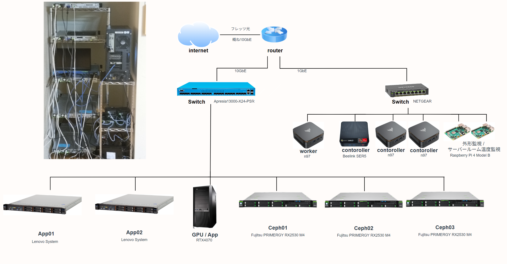
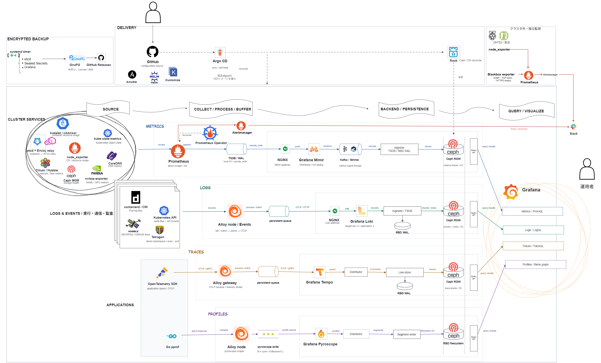

# Homelab

上は機器とネットワークの物理構成、下は観測データの収集・保存・可視化を中心とした構成図です。

## このラボについて

Kubernetesを中心に、アプリケーションの配布、ネットワーク、分散ストレージ、オブザーバビリティを構築した自宅ラボです。ラックサーバー、ミニPC、GPUノード、Raspberry Piを組み合わせて運用しています。

アプリケーションや基盤の状態を観測しながら、意図的な負荷をかけて実験しています。

## 主な構成

| 分野 | 役割 |
| --- | --- |
| クラスタ・通信 | Kubernetes(kubeadm)を中心に、Ciliumでクラスタ内の通信を制御。CoreDNSとkube-vipが名前解決とAPIへの接続を支える |
| 構成管理 | Ansibleでホストを準備し、Helm・Kustomizeで定義した構成をArgo CDで同期 |
| ストレージ | RookでCephを管理し、ブロックストレージとS3互換のオブジェクトストレージを提供 |
| 証明書・秘密情報 | cert-managerで証明書を管理し、Sealed Secretsで暗号化した秘密情報をGitで扱う |
| 通信・実行の観測 | Hubbleの通信ログ、対象アプリのTetragonイベント、Kubernetes監査ログで挙動を追う |

## オブザーバビリティ

メトリクス・ログ・トレース・プロファイルを収集し、Grafanaから各バックエンドを検索・表示します。

| 観測データ | 主な経路 | 見ていること |
| --- | --- | --- |
| メトリクス | Prometheus → Mimir | CPU・メモリ・ディスク・GPUの状態、クラスタやストレージの健全性 |
| ログ・イベント | Alloy → Loki | エラーの内容、状態変化、通信や実行の記録 |
| トレース | OpenTelemetry → Alloy → Tempo | リクエストの処理経路、時間がかかっている処理 |
| プロファイル | Go pprof → Alloy → Pyroscope | アプリケーションのCPU時間やメモリの使われ方 |

普段はGrafanaで全体の状態を確認し、気になる変化があれば関連するログやトレース、プロファイルを調べます。障害と復旧はAlertmanagerからSlackへ通知します。

## 独立監視とバックアップ

クラスタ外のRaspberry Piでも、Blackbox exporter・Prometheus・Alertmanagerを動かしています。クラスタへの接続性とKubernetes APIを外側から確認し、DHT22でサーバールームの温度・湿度も計測します。クラスタ内の監視とは別の経路で異常を通知します。(スイッチ　ルーター落ちたら..(*^^*))

復旧に備え、etcdのスナップショット、Sealed Secretsの復号鍵、GrafanaのDB・設定を日次で暗号化し、非公開のGitHub Releasesへ保存しています。

---

## クレジット

図中の製品名・ロゴ・製品画像の権利は、それぞれの権利者に帰属します。本リポジトリは個人のホームラボを紹介するもので、各プロジェクト・企業との提携や推奨を示すものではありません。

ロゴの出典・帰属・ライセンス

| 名称・素材 | クレジット・出典 |
| --- | --- |
| systemd logomark | Tobias Bernard（2019）。[公式素材](https://brand.systemd.io/) · [CC BY-SA 4.0](https://creativecommons.org/licenses/by-sa/4.0/) |
| GnuPG logo | Thomas Wittek、© 2006 g10 Code GmbH。[GnuPG](https://gnupg.org/) · [素材のライセンス](https://github.com/gpg/gnupg/blob/master/artwork/README) · [CC BY-SA 4.0](https://creativecommons.org/licenses/by-sa/4.0/) |
| Ansible Community Mark | Ansible Logos Project / Red Hat, Inc.。[公式素材](https://github.com/ansible/logos) · [CC BY-SA 4.0](https://creativecommons.org/licenses/by-sa/4.0/) |
| Argo、Cilium、containerd、Envoy、etcd、Helm、OpenTelemetry、Prometheus、Rook、CoreDNS、cert-manager | The Linux Foundationの商標または登録商標。[CNCF公式素材](https://github.com/cncf/artwork) · [商標情報](https://www.linuxfoundation.org/legal/trademarks) |
| Kubernetes、Strimzi、kube-vip、Ceph | LF Projects, LLCの商標または登録商標。[商標情報](https://lfprojects.org/policies/trademark-policy/) · [Ceph公式素材](https://ceph.io/en/logos/) |
| Hubble、Tetragon | Ciliumプロジェクト。[公式ブランド素材](https://cilium.io/brand/) |
| Prometheus Operator、kube-state-metrics、Kustomize | 各プロジェクトおよび関連するPrometheus・Kubernetesの権利者。[Prometheus Operator](https://github.com/prometheus-operator/prometheus-operator/tree/main/Documentation/logos) · [kube-state-metrics](https://github.com/kubernetes/kube-state-metrics) · [Kustomize](https://kustomize.io/) |
| Grafana、Alloy、Loki、Mimir、Tempo、Pyroscope | Grafana Labsの商標・ロゴ。[公式サイト](https://grafana.com/) · [商標情報](https://grafana.com/trademark-policy/) |
| GitHub | GitHub, Inc.の商標。[公式ブランド素材](https://brand.github.com/foundations/logo) |
| Slack | Slack is a trademark of Salesforce, Inc. [商標情報](https://www.salesforce.com/company/legal/intellectual-property/) |
| Raspberry Pi | Raspberry Pi is a trademark of Raspberry Pi Ltd. [商標情報](https://www.raspberrypi.com/trademark-rules/) |
| Apache Kafka | Apache、Apache Kafka、KafkaおよびKafkaロゴはThe Apache Software Foundationの商標または登録商標。[Apache Kafka](https://kafka.apache.org/) · [商標情報](https://www.apache.org/foundation/marks/) |
| NGINX | F5, Inc.の商標または登録商標。[公式サイト](https://docs.nginx.com/) · [商標情報](https://www.f5.com/company/policies/trademarks) |
| NVIDIA | NVIDIA Corporationの商標または登録商標。[公式ブランド素材](https://www.nvidia.com/en-us/about-nvidia/legal-info/logo-brand-usage/) |
| Go | Googleの商標。[公式ロゴ](https://go.dev/blog/go-brand) · [ブランド情報](https://go.dev/brand) |
| 温度センサー記号 | [AWS Architecture Icons](https://aws.amazon.com/architecture/icons/)由来の[draw.io図形セット](https://www.drawio.com/docs/diagram-types/aws-diagrams/)を使用 |

systemd・GnuPG・Ansibleの素材は、図中への配置・拡縮・PNG形式への書き出しを行っています。各素材のライセンス表記は、その素材に適用されます。

